# ♻️ AI-Powered Smart Waste Management System Using Deep Learning

## 📌 Project Overview

This project is an **AI-powered Smart Waste Management System** developed using **EfficientNetB0 Deep Learning**. It automatically classifies waste from **Camera 📷** or **Gallery 🖼️** images and provides **CO₂ Savings 🌱**, **Green Points 🏆**, **Dashboard 📊**, and a **Professional PDF Report 📄**.

---

# ✨ Features

- ✅ 📷 Camera Input (Back Camera)
- ✅ 🖼️ Gallery Input (Multiple Images)
- ✅ 🤖 AI Waste Classification
- ✅ 📊 Interactive Dashboard
- ✅ 🥧 Pie Chart Analysis
- ✅ 📈 Bar Chart Analysis
- ✅ 🌱 CO₂ Savings Estimation
- ✅ 🏆 Green Points Calculation
- ✅ ⭐ Green Score
- ✅ ♻️ Sustainability Analysis
- ✅ 📄 PDF Report Generation
- ✅ 📁 CSV Report Generation
- ✅ 🔄 Reset Data

---

# 🛠️ Technologies Used

- 🐍 Python
- 🤖 TensorFlow
- 🧠 EfficientNetB0
- 📊 Pandas
- 🔢 NumPy
- 📈 Matplotlib
- ☁️ Google Colab
- 📄 ReportLab

---

# 🔄 Project Workflow

```text
📷 Camera / 🖼️ Gallery
           │
           ▼
🖼️ Image Preprocessing
           │
           ▼
🤖 EfficientNetB0 Model
           │
           ▼
♻️ Waste Classification
           │
           ▼
🌱 CO₂ Savings & 🏆 Green Points
           │
           ▼
📊 Dashboard
           │
           ▼
📄 PDF Report
```

---

# 📸 Project Demonstration


## 🖥️ Main Menu

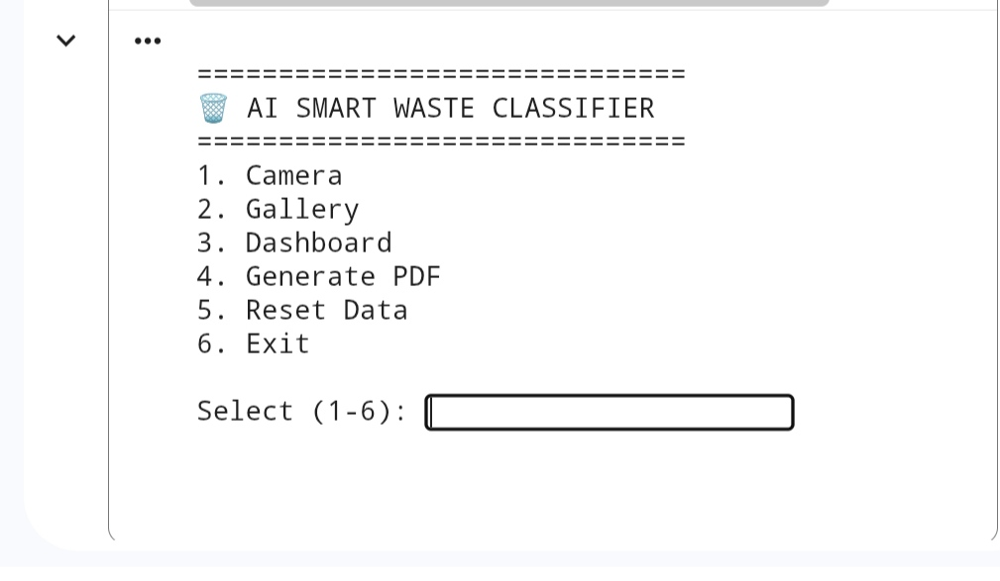

| 📷 Camera Input | 🖼️ Gallery Input |
|----------------|------------------|
| 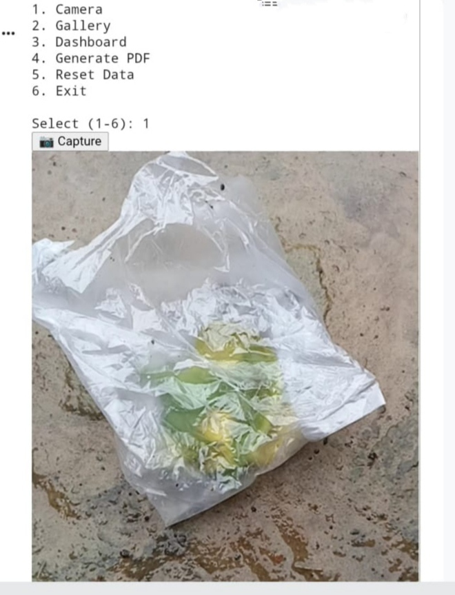 | 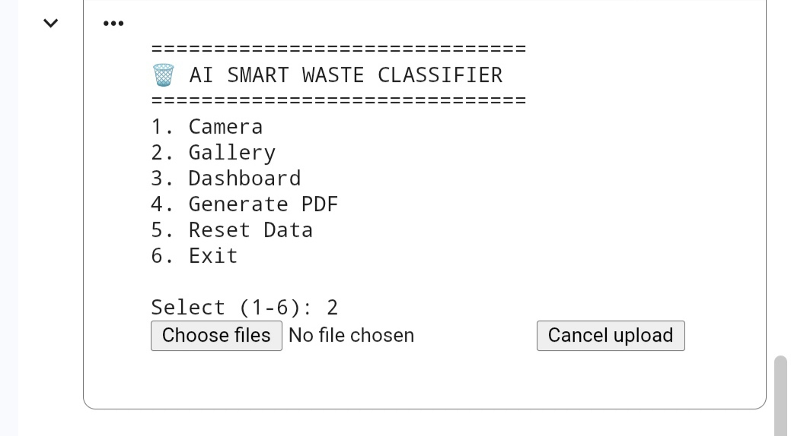 |

## 📥 Input Images

| Cardboard | Glass | Metal |
|-----------|--------|--------|
| 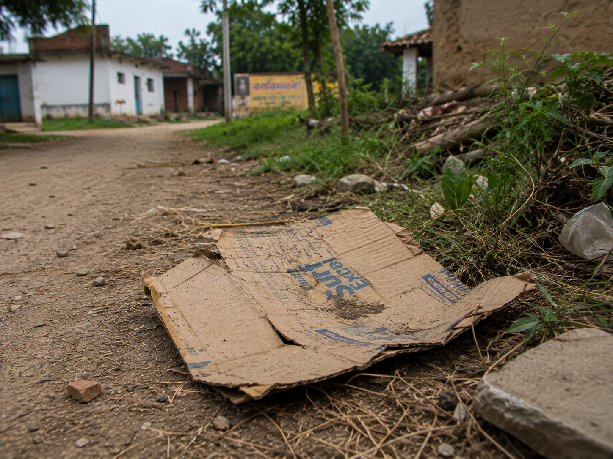 | 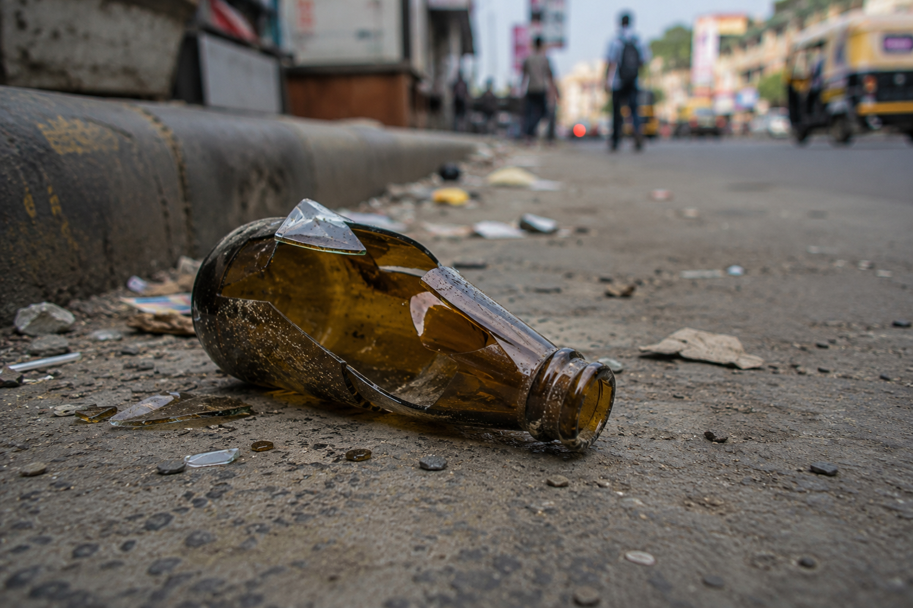 | 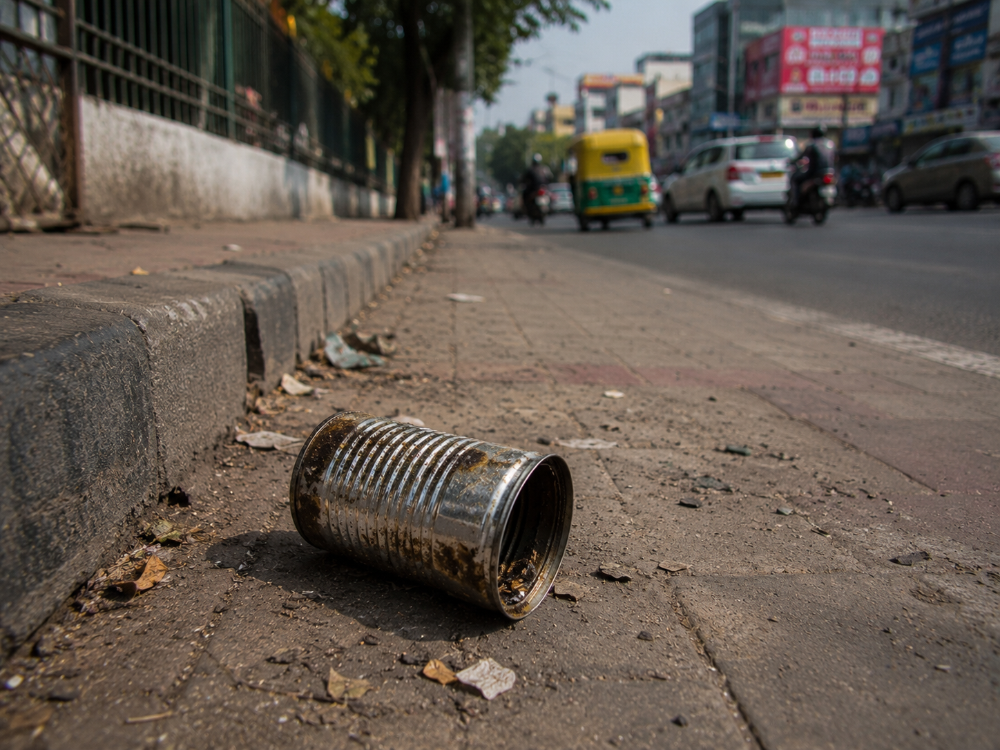 |

| Paper | Plastic | Trash |
|--------|----------|-------|
| 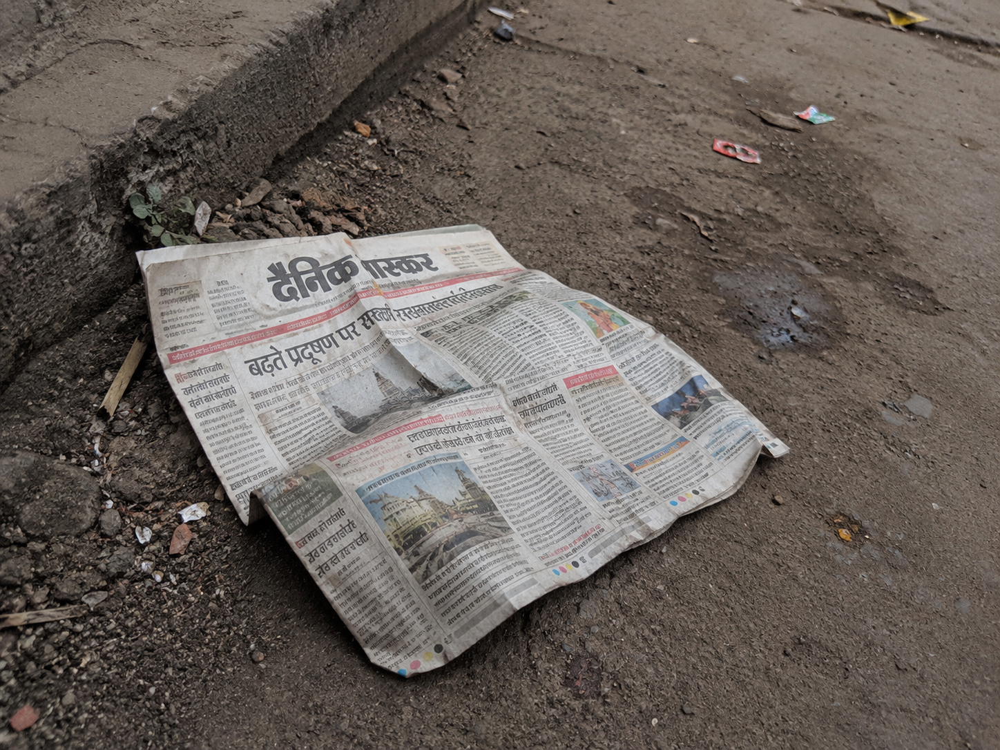 | 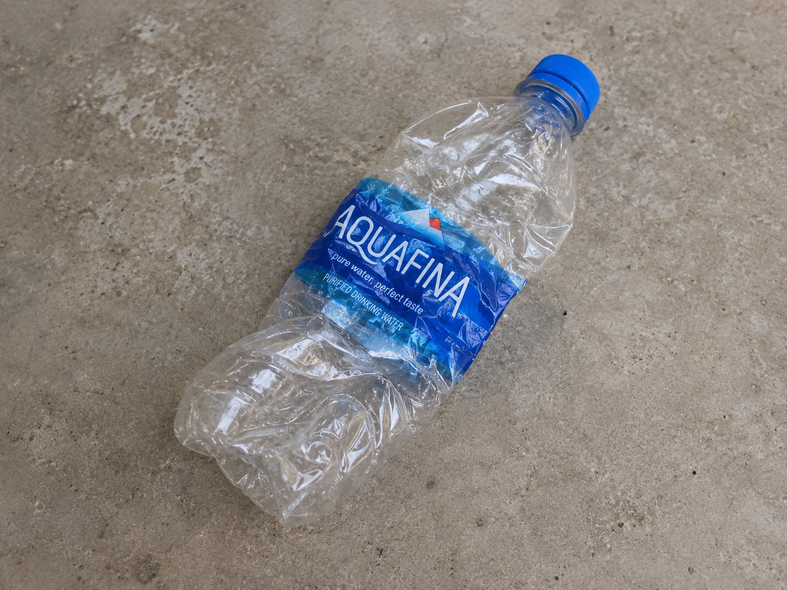 | 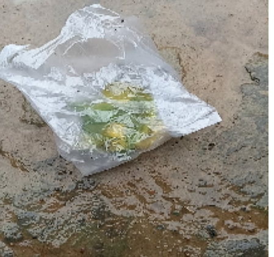 |

---

## 📤 Prediction Outputs

| Cardboard | Glass | Metal |
|-----------|--------|--------|
| 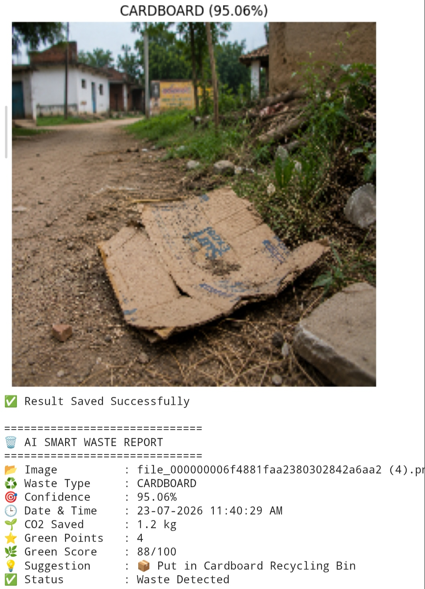 | 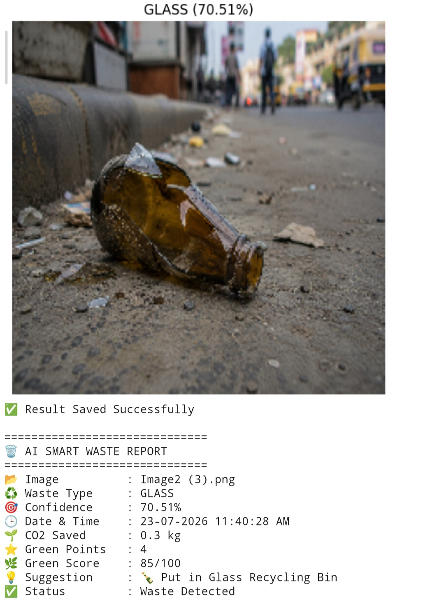 | 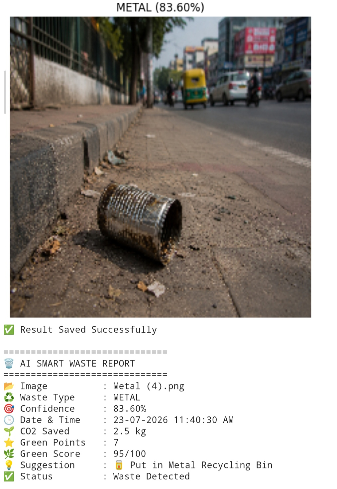 |

| Paper | Plastic | Trash |
|--------|----------|-------|
| 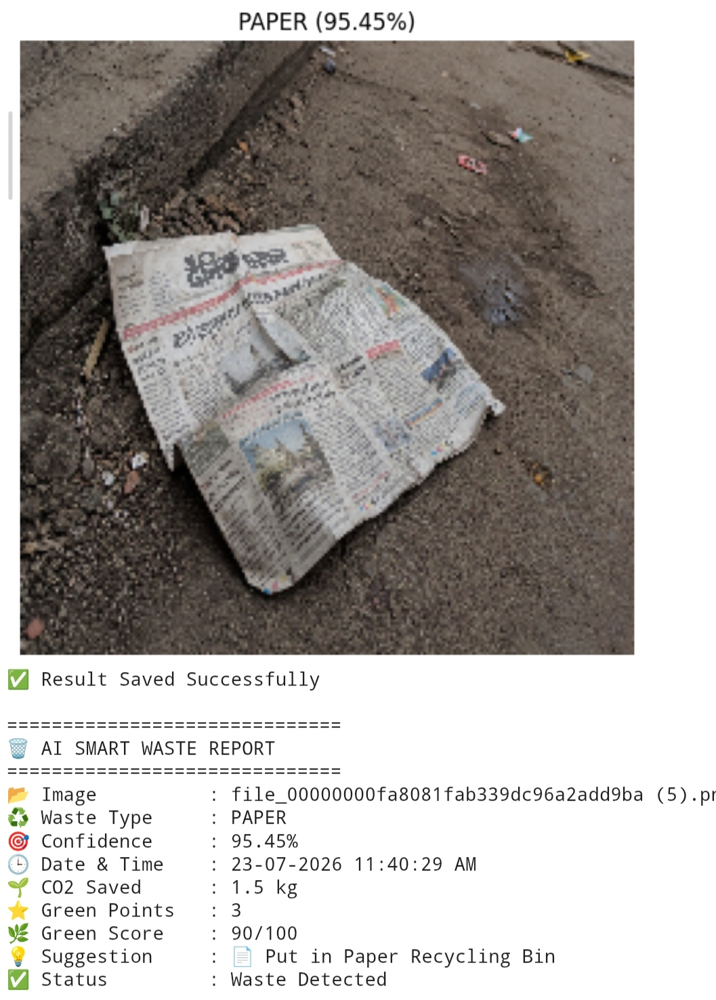 | 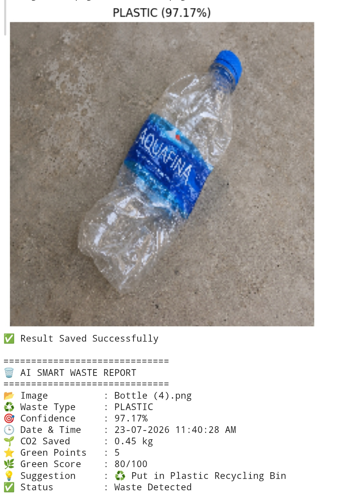 | 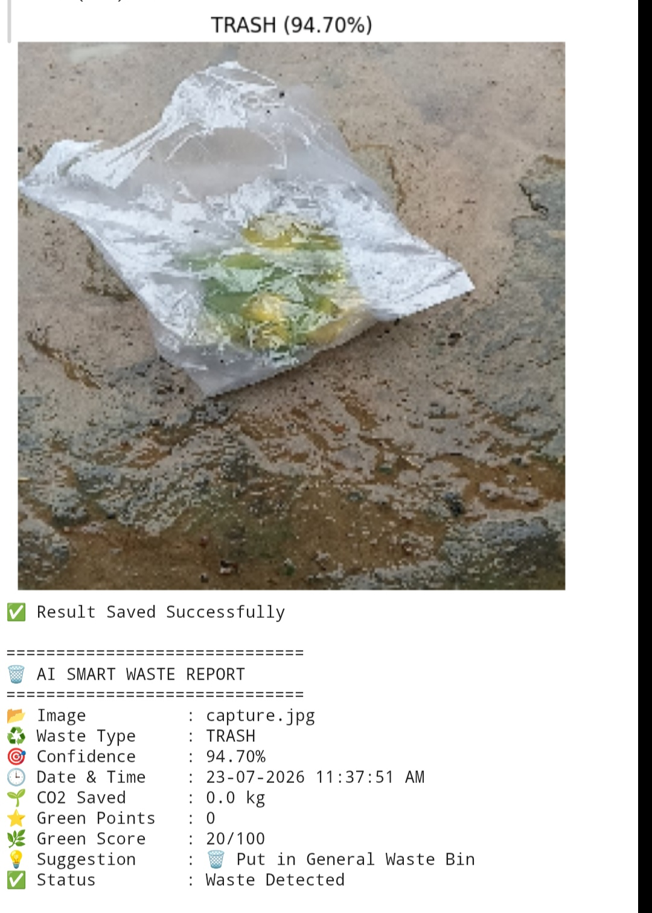 |

---

# 📊 Dashboard

### 🥧 Waste Distribution

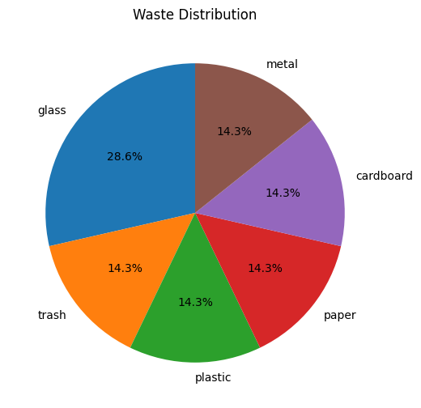

### 📈 Waste Count

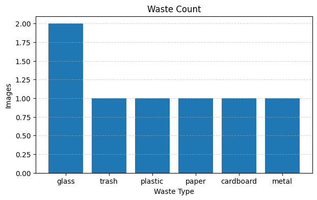

---
# 📄 Generated PDF Report

Click below to view or download the sample report.

➡️ **[View AI Smart Waste Report](AI_Smart_Waste_Report.pdf)**
---

# 🌍 Sustainability Impact

- ♻️ Promotes Recycling
- 🌱 Reduces CO₂ Emissions
- 🌍 Supports Sustainable Waste Management
- 🗑️ Improves Waste Segregation
- 🎯 Supports Sustainable Development Goals (SDGs)

---

# 🚀 Future Scope

- 📹 CCTV-Based Waste Detection
- 📱 Android Application
- ☁️ Cloud Database Integration
- 📍 GPS-Based Waste Monitoring
- 🗑️ Smart IoT Dustbin
- 🌆 Smart City Integration

---

# 📂 Dataset

**📦 TrashNet Dataset**

### Waste Categories

- ♻️ Plastic
- 📄 Paper
- 🍾 Glass
- 🥫 Metal
- 📦 Cardboard
- 🗑️ Trash

---

# ▶️ How to Run

1. Open Google Colab
2. Upload the TrashNet Dataset
3. Run all notebook cells
4. Select **Camera** or **Gallery**
5. View the Dashboard
6. Generate the PDF Report

---

# 👨‍💻 Author

**Upendra Kumar Kushwaha**

🎓 B.Tech – Artificial Intelligence & Machine Learning

🏫 Shri Ram Institute of Technology, Jabalpur

---

# 📜 License

This project is developed for **educational and sustainability purposes**.
